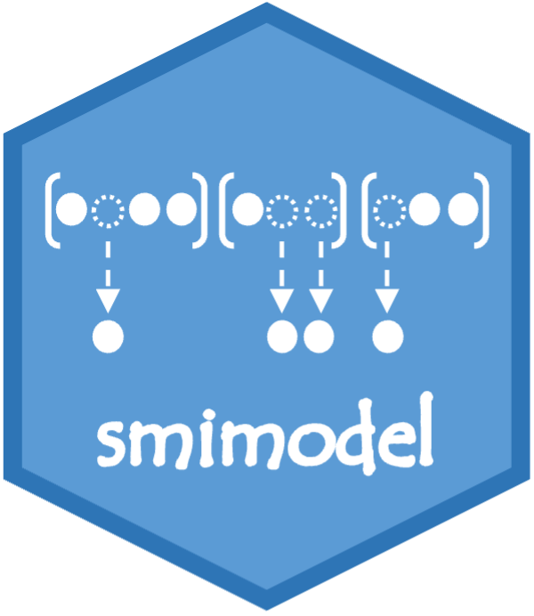

<!-- README.md is generated from README.Rmd. Please edit that file -->

```{r, include = FALSE}
knitr::opts_chunk$set(
  collapse = TRUE,
  comment = "#>",
  fig.path = "man/figures/README-",
  out.width = "100%"
)
```

# smimodel </a>

<!-- badges: start -->
<!-- badges: end -->

The goal of smimodel is to provide functions to estimate nonparametric multiple index models (which are an extension of nonparametric additive models) for time series forecasting. The estimation algorithm simultaneously performs variable selection (hence "sparse") enabling parsimonious forecasting models in a high-dimensional context.

## Installation

You can install the the development version of smimodel from [GitHub](https://github.com/) with:

``` r
# install.packages("devtools")
devtools::install_github("nuwani-palihawadana/smimodel")
```

## Example

This is a basic example which shows you how to solve a common problem:

```{r example}
library(smimodel)
## basic example code
```

