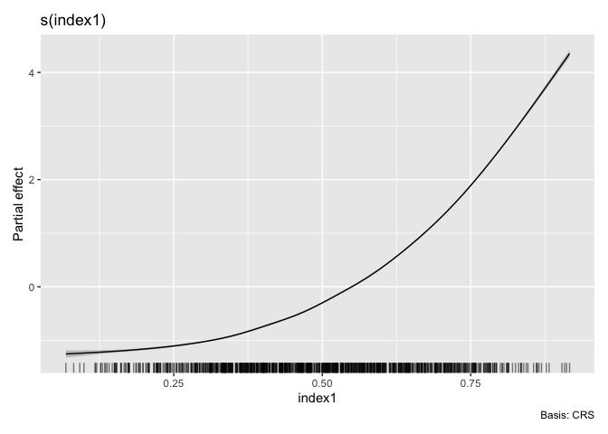

<!-- README.md is generated from README.Rmd. Please edit that file -->

# smimodel 

<!-- badges: start -->
<!-- badges: end -->

The R package *smimodel* provides functions to estimate Sparse Multiple
Index (SMI) Models for nonparametric forecasting. The SMI Modelling
algorithm simultaneously performs optimal predictor selection (hence
“sparse”) and predictor grouping, enabling parsimonious forecasting
models in a high-dimensional context.

The package also includes functions to fit some benchmark comparison
methods namely nonparametric additive model with backward elimination,
group-wise additive index model and projection pursuit regression. These
functions have a similar syntax and output format to `model_smimodel()`
for convenient usage and interchangeability.

For detailed information regarding the SMI Modelling algorithm refer
<https://github.com/nuwani-palihawadana/smimodel_paper/blob/main/paper/smimodel.pdf>
.

## Installation

You can install the the development version of smimodel from
[GitHub](https://github.com/) with:

``` r
# install.packages("devtools")
devtools::install_github("nuwani-palihawadana/smimodel")
```

## Example

This is a basic example, which shows you how to estimate a SMI model,
and obtain predictions on a test set:

``` r
library(smimodel)
library(dplyr)
library(ROI)
library(tibble)
library(tidyr)
library(tsibble)

# Simulate data
n = 1205
set.seed(123)
sim_data <- tibble(x_lag_000 = runif(n)) %>%
  mutate(
    # Add x_lags
    x_lag = lag_matrix(x_lag_000, 5)) %>%
  unpack(x_lag, names_sep = "_") %>%
  mutate(
    # Response variable
    y1 = (0.9*x_lag_000 + 0.6*x_lag_001 + 0.45*x_lag_003)^3 + rnorm(n, sd = 0.1),
    # Add an index to the data set
    inddd = seq(1, n)) %>%
  drop_na() %>%
  select(inddd, y1, starts_with("x_lag")) %>%
  # Make the data set a `tsibble`
  as_tsibble(index = inddd)
# Training set
sim_train <- sim_data[1:1000, ]
# Test set
sim_test <- sim_data[1001:1200, ]

# Index variables
index.vars <- colnames(sim_data)[3:8]
```

``` r
# Estimate SMI model (with "PPR" initialisation)
smimodel_ppr <- model_smimodel(data = sim_train,
                               yvar = "y1",
                               index.vars = index.vars,
                               initialise = "ppr")

# Fitted SMI model
smimodel_ppr$fit[[1]]$best
```

``` r
# Plot estimated smooths
autoplot(object = smimodel_ppr)
```



``` r

# Obtain residuals and fitted values
augment(x = smimodel_ppr)
#> # A tibble: 1,000 × 5
#>    Index New     Old  .resid .fitted
#>    <int> <chr> <dbl>   <dbl>   <dbl>
#>  1     6 1         1  0.0859   0.495
#>  2     7 1         1  0.0766   0.737
#>  3     8 1         1  0.137    3.70 
#>  4     9 1         1  0.0173   1.15 
#>  5    10 1         1  0.118    0.942
#>  6    11 1         1 -0.201    3.65 
#>  7    12 1         1 -0.0471   1.83 
#>  8    13 1         1  0.0111   1.28 
#>  9    14 1         1 -0.0464   2.46 
#> 10    15 1         1  0.0243   0.261
#> # ℹ 990 more rows
```

``` r
# Obtain forecasts on the test set
predict(object = smimodel_ppr, newdata = sim_test)$.predict
```

## License

This package is free and open source software, licensed under GPL-3.
